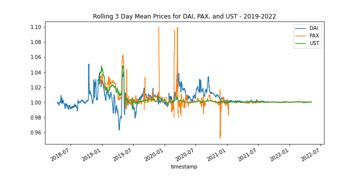

# StableOps

**StableOps** is an analysis of potential arbitrage opportunities derived from volatility in stablecoin pricing.  It was observed that many stablecoins have some volatility.  Although usually pegged to a FIAT currency, like the US dollar, they sometimes drift to be a little over or under their peg value. 


If this volatility could be harnessed, it might be profitable.  The objective of this project is to analyze volatility in stablecoin pricing and assess whether this volatility could provide profitable arbitrage opportunities. 

---

## Data Sources

| Dataset | URL         | Description | Size | Records |
|---------|-------------|-------------|------|---------|
| daiusd.csv | https://www.kaggle.com/datasets/tencars/392-crypto-currency-pairs-at-minute-resolution | DAI USD price at 1 minute resolution, from the Kaggle 400+ crypto currency pairs at 1-minute resolution dataset | 13.7 MB | 256,066 |
| paxusd.csv | https://www.kaggle.com/datasets/tencars/392-crypto-currency-pairs-at-minute-resolution | PAX USD price at 1 minute resolution, from the Kaggle 400+ crypto currency pairs at 1-minute resolution dataset | 7.2 MB | 143,564 |
| ustusd.csv | https://www.kaggle.com/datasets/tencars/392-crypto-currency-pairs-at-minute-resolution | UST USD price at 1 minute resolution, from the Kaggle 400+ crypto currency pairs at 1-minute resolution dataset | 13.7 MB | 1,230,255 |
| GUSD | https://api.coingecko.com/api/v3/coins/gemini-dollar/market_chart?vs_currency=usd&days=1095&interval=daily | Daily price for GUSD from coingecko API |  | 1096 |
| USDC | https://api.coingecko.com/api/v3/coins/usd-coin/market_chart?vs_currency=usd&days=1095&interval=daily | Daily price for USDC from coingecko API |  | 1096 |
| USDT | https://api.coingecko.com/api/v3/coins/tether/market_chart?vs_currency=usd&days=1095&interval=daily | Daily price for USDT from coingecko API |  | 1095 | 
| PAX | https://api.coingecko.com/api/v3/coins/paxos-standard/market_chart?vs_currency=usd&days=1095&interval=daily | Daily price for PAX from coingecko API |  | 1096 |
| DAI | https://api.coingecko.com/api/v3/coins/dai/market_chart?vs_currency=usd&days=1095&interval=daily | Daily price for DAI from coingecko API |  | 905 |
| UST | https://api.coingecko.com/api/v3/coins/nusd/market_chart?vs_currency=usd&days=1095&interval=daily | Daily price for UST from coingecko  API |  | 1095 |
| Gemini_USTUSD_1h.csv | https://www.cryptodatadownload.com/data/gemini/ | Hourly price data for Luna from Gemini | 220 KB | 2350 |
| Gemini_LUNAUSD_1h.csv | https://www.cryptodatadownload.com/data/gemini/ | Hourly price data for Luna from Gemini | 223 KB | 2350 |
| ust-usd-max.csv | https://www.coingecko.com/en/coins/terra-usd/historical_data?end_date=2022-05-13&start_date=2022-04-29#panel | Daily UST price, market cap and trading volume from coingecko | 46 KB | 589 |
| luna-usd-max.csv | https://www.coingecko.com/en/coins/terra-luna/historical_data?end_date=2022-05-13&start_date=2022-04-29#panel | Daily LUNA price, market cap and trading volume from coingecko | 86 KB | 1102 |

---

## Technologies Used

* **Pandas**  - A python library with advanced financial analysis tools.
* **Jupyter Lab** - An IDE used for visualization.
* **anaconda** - A python framework consisting of several tools used in financial analysis, such as Pandas and Jupyter Lab.
* **Requests** - A python library used to interact with APIs.
* **JSON** - A python library that facilitates working with data in JSON format.
* **python-dotenv** - A python library used to configure an environment through key-value pairs stored in a file.
* **hvplot** - A set of Python visualization tools used to create compelling, and interactive visualizations.  
* **pytz** - A python library that facilitates time zone handling and conversion
* **Jupyter Notebook Slides** - Uses Jupyter Notebook and turns it into a slideshow for a technical presentation.

---

## Installation Guide
### Prerequisites
* Ensure that Anaconda is installed
* It is recommended that a conda virtual environment is created and used for this analysis
```
conda create -n <environment name> python=3.7 anaconda
conda activate <environment name>
```
**note:** remember to deactivate your environmnent when done with `conda deactivate`
* ensure hvplot is installed in your conda environment
```
conda install hvplot
```
see [hvplot installation guide](https://github.com/conda-forge/hvplot-feedstock#:~:text=Installing%20hvplot%20from%20the%20conda-forge%20channel%20can%20be,has%20been%20enabled%2C%20hvplot%20can%20be%20installed%20with%3A) for more information.

### Start Jupyter Lab
Once your conda virtural environment is started with all prerequisites, start Jupyter Lab:
```
jupyter lab
```

---

## Usage

### StableOps Analysis Notebook
Once Jupyter Lab has started in your browser, select the **StableOps.ipynb** notebook from the **Left Sidebar**.  This is the main analytical notebook.


### StableOps Presentation Notebook
Launch the Desktop Jupyter Notebook app. Start by selecting **View** from the menu followed by **Cell Toolbar** and **Slideshow**.


Once **Slideshow** is activated, changing the view will allow to set the type of slides for each cell. There are 5 Types of slides to choose from:

- **Slide** | Main content of a slide - can use markdown, visuals, or code.
- **Sub-Slide** | Considered as a new slide with transition animation.
- **Fragment** | Component of the previous cell. Fragment will be inside the main slide but with a fade-in transition.
- **Skip** | This cell will not be shown on the slides.
- **Notes** | Creates Speaker notes (not tested - need a local copy of the Reveal.JS file)


YOU CAN HIDE THE CODES FROM THE SLIDE by changing the **Cell Toolbar** view into **Tags** (View -> Cell Toolbar View -> Tags). For each code cell that has visualisation element, enter *"to_remove"* on the field and press **Add Tag**.


### Run StableOps Presentation
Simply open the presentation file using a browser.


### Run a New Version of the StableOps Presentation
In the StableOps directory type in:
```
jupyter nbconvert "StableOps_Presentation_01.ipynb" --to slides --no-prompt --TagRemovePreprocessor.remove_input_tags={\"to_remove\"} --post serve 
```
This will create a new "StableOps_Presentation_01.slides .html" and run the new presentation using a browser.

### Additional Notebooks
* **intraday.ipynb** - A notebook that analyzed stablecoin volatility using high resolution data, up to 1 minute intervals.
* **stable_coin_compare.ipynb** - A notebook that surveyed and analyzed yield farming opportynities.
* **Terra.ipynb** - A notebook that analuzed the collapse of UST and LUNA that occured between 2022-05-07 - 2022-05-14

---

## Summary of Analysis and Results
### Method
The following analysis was conducted:
* Analysis of selected stablecoin price volatility using daily data spanning several years
* Analysis of selected stablecoin price intraday volatility using i minute interval data spanning several years
* Rolling Period analysis of daily and intraday stablecoin price volatility to assess trends over different time periods
* Survey of yield farming yields as a safe alternative to arbitrage on stablecoin price volatility
* Modelling of arbitrage based on stablecoin price volatility and yield farming returns
* Risk Reward analysis using Sharpe Ratio
* as a bonus, analysis of the UST/LUNA collapse
### Key Results

* Volatility trends changed over time
* Significant volatility tended to span a few days
  

* sUSD represents the best arbitrage candidate of the coins we analyzed

* Despite the potential high return of arbitrage on sUSD, the Sharpe ratio favors yield farming due to the high volatility of sUSD.  The Sharpe Ratio of sUSD is still significantly above 1 and therefore still favorable and may be a good fit for those with higher risk tolerance.

* The arbitrage opportunity was different than the one we modelled: UST <-> LUNA, rather than spot price <-> peg
* During the UST/LUNA collapse, a high amount of nearly instantaneous intraday arbitrage occurred

---

## Contributors

*  **Quintin Bland** <span>&nbsp;&nbsp;</span> |
<span>&nbsp;&nbsp;</span> *email:* quintinbland2@gmail.com <span>&nbsp;&nbsp;</span>|
<span>&nbsp;&nbsp;</span> [](https://www.linkedin.com/in/quintin-bland-a2b94310b/)

*  **Kevin Corstorphine** <span>&nbsp;&nbsp;</span> |
<span>&nbsp;&nbsp;</span> *email:* kevincorstorphine@gmail.com <span>&nbsp;&nbsp;</span>|
<span>&nbsp;&nbsp;</span> [](https://www.linkedin.com/in/kevin-corstorphine-9020a7113/)

*  **John Gruenewald** <span>&nbsp;&nbsp;</span> |
<span>&nbsp;&nbsp;</span> *email:* john.h.gruenewald@gmail.com <span>&nbsp;&nbsp;</span>|
<span>&nbsp;&nbsp;</span> [](https://www.linkedin.com/in/jhgruenewald/)

*  **Martin Smith** <span>&nbsp;&nbsp;</span> |
<span>&nbsp;&nbsp;</span> *email:* msmith92663@gmail.com <span>&nbsp;&nbsp;</span>|
<span>&nbsp;&nbsp;</span> [](https://www.linkedin.com/in/smithmartinp/)

*  **Yanick Wiliksy** <span>&nbsp;&nbsp;</span> |
<span>&nbsp;&nbsp;</span> *email:* yanickw@gmail.com <span>&nbsp;&nbsp;</span>|
<span>&nbsp;&nbsp;</span> [](https://www.linkedin.com/in/yanickwilisky/)

---

## License

[](LICENSE)
